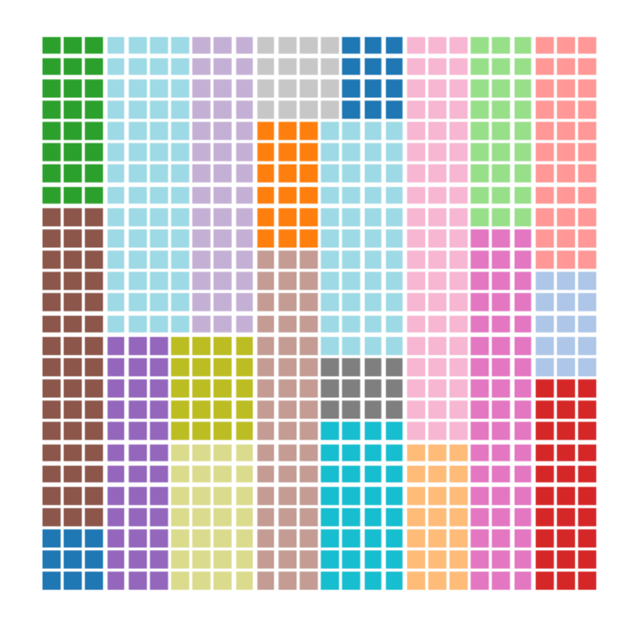

# Combinatorial and Decision Making Project: Perfect Weighted Packing (PWP) Problem

This project focuses on solving the Perfect Weighted Packing (PWP) problem, which involves packing a set of rectangles into a strip without overlapping, using two different approaches: Constraint Programming (CP) and Satisfiability Modulo Theories (SMT).

*A solution of the PWP problem for 26x26 instance*

## Problem Description

Given a strip of width `W` and height `H`, and a set of rectangles `R1, R2, ..., Rn` with widths `w1, w2, ..., wn` and heights `h1, h2, ..., hn`, the goal is to find a way to pack these rectangles into the strip without overlapping.

## Project Structure

- `CP/`: directory describing the CP model and its results. It contains a `README.md` with all the instructions for running the models and the relative report.
- `SAT_SMT/`: directory describing the SMT model and its results. It contains a `README.md` with all the instructions for running the models and the relative report.
- `Instances/`: directory with all the test to be passed

## Credits

This project was developed by Alberico Arcangelo for the Combinatorial and Decision Making course at the University of Bologna.